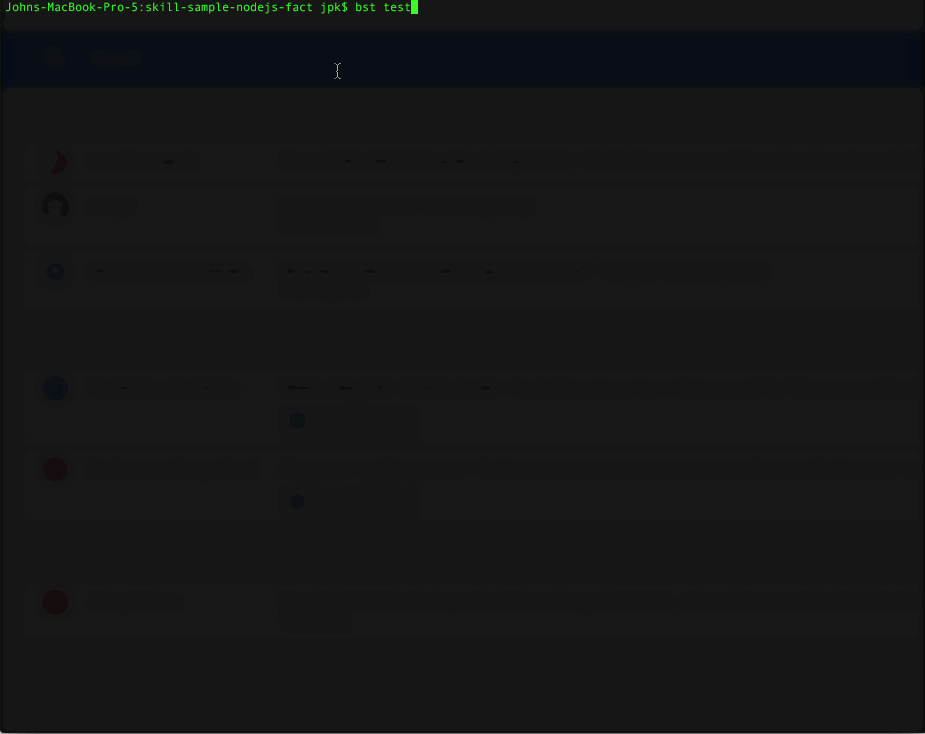
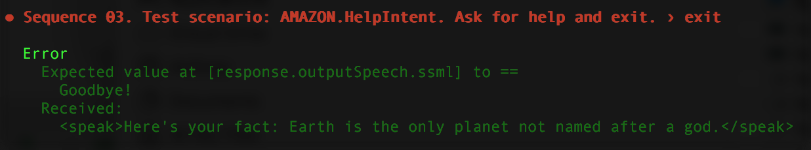

# Getting Started With Skill Testing
It's easy to unit-test your Alexa skill with Bespoken.



Here's a sample from the tests being run:

```YAML
---
configuration:
  locale: en-US

---
- test: "Sequence 01. Test scenario: launch request, no further interaction."
- LaunchRequest: # LaunchRequest is not an utterance but a request type and "reserved" word
  - response.outputSpeech.ssml: "Here's your fact"
  - response.card.type: "Simple"
  - response.card.title: "Space Facts"
  - response.card.content: "/.*/" # Regular expression indicating any text will match

---
- test: "Sequence 02. Test scenario: GetNewFactIntent with different utterances."
- "ask space facts to tell me a space fact":
  - response.outputSpeech.ssml: "/here's your fact.*/i"
  - response.card.type: "Simple"
  - response.card.title: "Space Facts"
  - response.card.content: "/.*/"
- "tell space facts to give me fact":
  - response.outputSpeech.ssml: "/here's your fact.*/i"
  - response.card.type: "Simple"
  - response.card.title: "Space Facts"
  - response.card.content: "/.*/"
- "ask space facts to give me a space trivia":
  - response.outputSpeech.ssml: "/here's your fact.*/i"
  - response.card.type: "Simple"
  - response.card.title: "Space Facts"
  - response.card.content: "/.*/"
```

## Setup
To get started, you need to install Bespoken Tools.

If you haven't already, follow these steps:

**Install NPM**  
[Instructions here](https://www.npmjs.com/get-npm) if you have not already installed npm.

**Open A Command Prompt**  
For Mac, run Applications -> Terminal
For Windows, run Node Environment

**Install Bespoken Tools**  
Once on the command-line, type:

```
npm install bespoken-tools -g
```

If that fails with a permission warning, you can simply run:
```
sudo npm install bespoken-tools -g
```

To confirm that it is installed, type: `bst` on the command-prompt. You should see something like this:
```
jpk-mbp:skill-testing-ml jpk$ bst
BST: v2.0.0  Node: v8.11.1


  Usage: bst [options] [command]
  **(Output truncated)**
```

## Run Your Tests
If you are starting with one of the Alexa sample projects, just go ahead and enter:
```
bst test
```

That's all there is to it!

## Understanding The Output


The top of the output is the result of each test.
Underneath each test is the sequence of interactions.

If any failed, they are marked with an X.

Below this list of tests, we see detailed output for any test that failed:


This tells the exact interaction that failed, as well as why it failed.
Based on this, we can either fix our test or fix the code.

The summary at the bottom tells us about the success of the tests, as well as basic code coverage info.

To see more detailed code coverage info, we can go to `coverage/lcov-report/index.html`.
This provides detailed information about the code coverage for our tests.

## Going Deeper
To add more tests, read our guide on the [Skill Testing Markup Language syntax here](guide.md).
