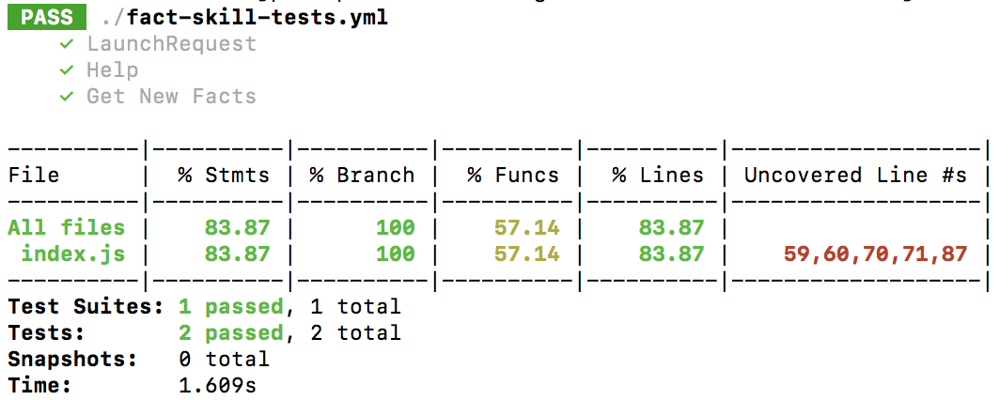

[](https://circleci.com/gh/bespoken/skill-testing-ml)
[](https://codecov.io/gh/bespoken/skill-testing-ml)
# The Skill Tester

## Setup
### Prerequisites
* Node.js >= 8.x.x

### Install
`npm install skill-testing-ml -g`

### Configure
Create a file called skill-testing.json at the root level of your project. It should look like this:
```json
{
  "handler": "index.handler", // Filename and function for the handler
  "locale": "en-US", // Locale
  "jest": { // Any overrides of core jest configuration
    "silent": false
  }
}
```

## How It Works
Here is a simple example, to test the Get Facts skill:
```
# A simple example of skill test suite
--- # Configuration YAML document
configuration:
  locale: en-US

--- # The --- indicates the start of a new test, which is a self-contained YAML document
- test: "Launches successfully" # Optional info about the test
- LaunchRequest: # LaunchRequest is "reserved" - it is not an utterance but a request type
  - response.outputSpeech.ssml =~ .*Here's your fact:.* # A comment
  - response.reprompt == undefined

---
- test: "Gets a new fact intent"
- "Help":
  - response.outputSpeech.ssml =~ .*You can say.*
- "Get New Facts":
  - response.outputSpeech.ssml == "Here's your fact:"
  - response.card.title  =~   Space Facts # Has extra spaces - need to be handled correctly
  - response.card.content != undefined
```
Run it:
```
skill-tester
```

Output:  


Read the [full specification](https://docs.google.com/document/d/17GOv1yVAKY4vmOd1Vhg_IitpyCMiX-e_b09eufNysYI/edit)

## Current Support
- [X] Multi-turn conversations
- [X] Dialog Interface support
- [X] AudioPlater interface support
- [X] Entity resolution

## Roadmap
- [ ] Explicit SessionEndedRequest
- [ ] Explicit intent and slot setting
- [ ] Support for goto and flow control
- [ ] Wildcard support for non-regex expressions
- [ ] Callbacks for filtering payloads programmatically
- [ ] Virtual device support
- [ ] Support for setting address and permissions
- [ ] Support for testing dynamo
